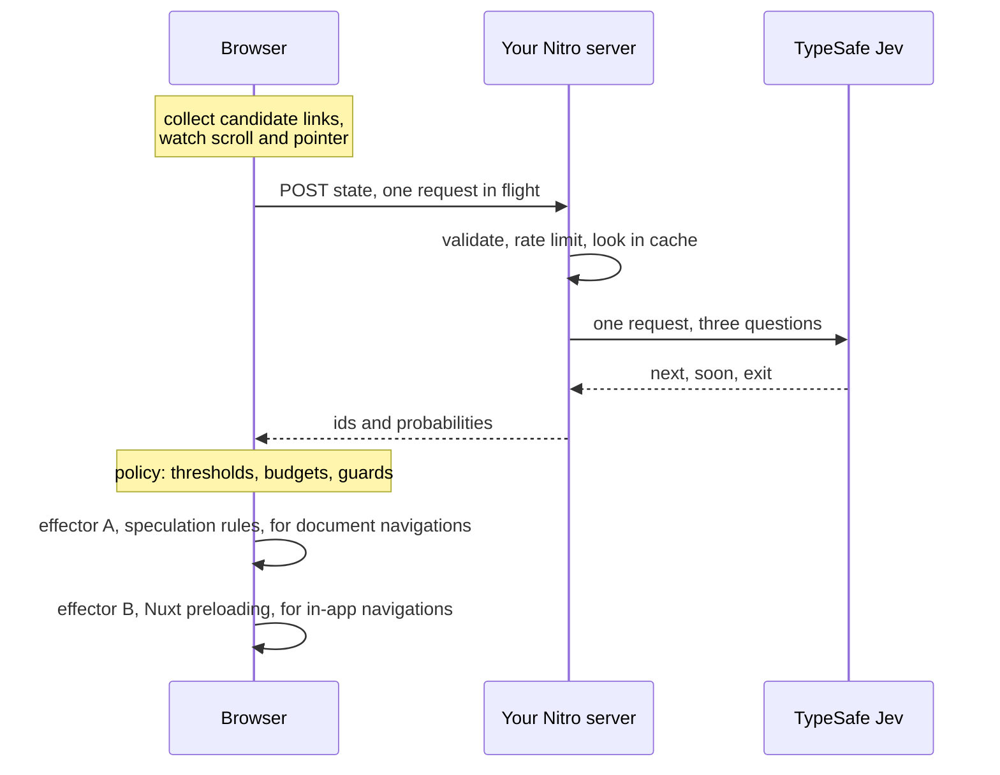

<p align="center">
  <a href="https://precog.oskarlebuda.dev">
    
  </a>
</p>

<p align="center">
  <a href="https://www.npmjs.com/package/nuxt-precog"></a>
  <a href="https://www.npmjs.com/package/next-precog"></a>
  <a href="./LICENSE"></a>
</p>

<p align="center">
  <a href="https://precog.oskarlebuda.dev"><b>Documentation</b></a>
</p>

---

Asks [TypeSafe](https://typesafe.ai/) Jev which link a visitor is about to click, then warms
exactly that navigation with the
[Speculation Rules API](https://developer.mozilla.org/en-US/docs/Web/API/Speculation_Rules_API)
and your framework's own preloading. It comes with an overlay that draws the probabilities on
top of the page, so you can watch it guess.

Not a general prefetcher. Nuxt and Next already prefetch every link that enters the viewport.
This one tries to prefetch three links instead of thirty, and to start before the hover.

| Package                          | For                                                           |
| -------------------------------- | ------------------------------------------------------------- |
| [`nuxt-precog`](./packages/nuxt) | Nuxt 3 and 4                                                  |
| [`next-precog`](./packages/next) | Next.js App Router                                            |
| [`precog-core`](./packages/core) | the framework-free half, if you want to write another adapter |

## Quickstart

**Nuxt**

```sh
npx nuxt module add nuxt-precog
```

**Next.js**, App Router:

```sh
npm install next-precog
```

```ts
// app/api/precog/route.ts
import { createPrecogHandler } from "next-precog/server";
export const POST = createPrecogHandler();
```

```tsx
// app/layout.tsx
import { PrecogProvider } from "next-precog";
// wrap children in <PrecogProvider>
```

Either way, set a key from
[console.typesafe.ai](https://console.typesafe.ai/settings/keys):

```sh
# .env
TYPESAFE_API_KEY="your-api-key"
```

A [Vercel AI Gateway](https://vercel.com/docs/ai-gateway) key goes in `AI_GATEWAY_API_KEY`
instead; the two are not interchangeable.

The full setup for each, including the one step in Next that actually matters, is in
**[the documentation](https://precog.oskarlebuda.dev)**.

## What it actually buys you

Eight scripted sessions per arm, six navigations each, real Chrome against a production build,
throttled to 250 ms latency and 2000 kbit/s, predictions from Jev. Method in
[the benchmark page](https://precog.oskarlebuda.dev/guide/benchmarks); reproduce
with `pnpm bench`.

| arm                   | off    | native | precog       |
| --------------------- | ------ | ------ | ------------ |
| navigation median     | 147 ms | 145 ms | **68 ms**    |
| navigation p95        | 404 ms | 397 ms | 395 ms       |
| hit rate              | n/a    | n/a    | 29%          |
| top guess correct     | n/a    | n/a    | 17%          |
| wasted kB / session   | 6.9    | 6.9    | 10.3         |
| jev calls / session   | 0      | 0      | 14.9         |
| jev latency p50 / p95 | n/a    | n/a    | 372 / 622 ms |

## How it works

One request per prediction, three questions, evaluated in parallel:

| Key    | Type                                      | Asked                                                     |
| ------ | ----------------------------------------- | --------------------------------------------------------- |
| `next` | choice over the candidate ids plus `none` | Which of these links will the visitor click next, if any? |
| `soon` | score over four levels                    | How soon will the visitor open another page?              |
| `exit` | yes/no                                    | Will the visitor leave the site entirely instead?         |



The short version of the important part: **a client-router click is not a document
navigation**, so speculation rules do nothing for it. That is measured in
`packages/nuxt/e2e/spa-vs-document.spec.ts`. The in-app win comes from warming the payload of
the pages the model picked, which only exists for routes rendered ahead of time.

:mag: [The full walk-through](https://precog.oskarlebuda.dev/guide/how-it-works)

## Limitations

- **Speculation rules are Chromium only.** Elsewhere, prefetch falls back to
  `<link rel="prefetch">` and prerender is skipped. Nuxt preloading works everywhere.
- **Payload preloading needs a payload**, which means prerendered routes with
  `experimental.payloadExtraction`. On a purely server-rendered route the win is small.
- **Prerendering runs the page's JavaScript.** Analytics fire, `onMounted` fetches run. This is
  why `mode` is `'prefetch'` by default.
- **It costs money per prediction.** Tune `minIntervalMs`, `cache.ttlSeconds` and the budgets
  before pointing it at real traffic.
- **Jev is in early access.** Every failure path returns an empty prediction and the page is
  untouched.

## Privacy

The module sends page context and part of a browsing path to a third party. It sends no
identifier of any kind, no full URLs, and never the API key.
[The privacy page](https://precog.oskarlebuda.dev/guide/privacy) lists exactly what
goes over the wire and how to gate it behind consent.

## Development

```sh
pnpm install
pnpm dev              # the Nuxt playground, needs a key in packages/nuxt/playground/.env
pnpm check            # lint, typecheck, unit tests
pnpm test:e2e         # builds everything and drives real Chrome
pnpm bench            # writes bench/results/bench.md
pnpm docs:dev         # the documentation site
pnpm client:dev       # the DevTools tab on its own, while working on it
```

`pnpm dev:prepare` builds the DevTools tab client into `dist/client`, which `pnpm dev` runs
first. To work on the tab itself, start `pnpm client:dev` and run the playground with
`PRECOG_DEVTOOLS_LOCAL=1`, which proxies the tab to that dev server instead.

The unit suite never touches the network: `test/mock-typesafe.ts` is a small stand-in for the
System One API. The live smoke test is skipped unless `TYPESAFE_API_KEY` is set.

One note that did not fit on the site: [decisions](./.github/DECISIONS.md), the running log of
why things are the way they are.

## Thanks

- [TypeSafe](https://typesafe.ai/) for **Jev**. It answers typed questions in about 100 ms,
  which is the only reason guessing a click before it happens is possible at all. A model that
  writes text would arrive long after the visitor had already clicked.
- [advocaat](https://github.com/pithings/advocaat) by [pi0](https://github.com/pi0), the small
  typed client this talks to Jev through. Its source is also where `test/mock-typesafe.ts` took
  the wire format from, which is what lets the whole test suite run offline.

## License

[MIT](./LICENSE)
