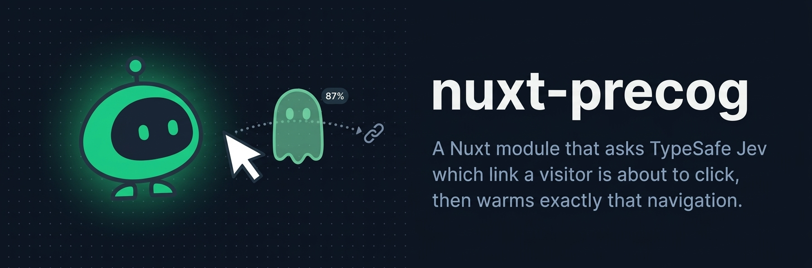
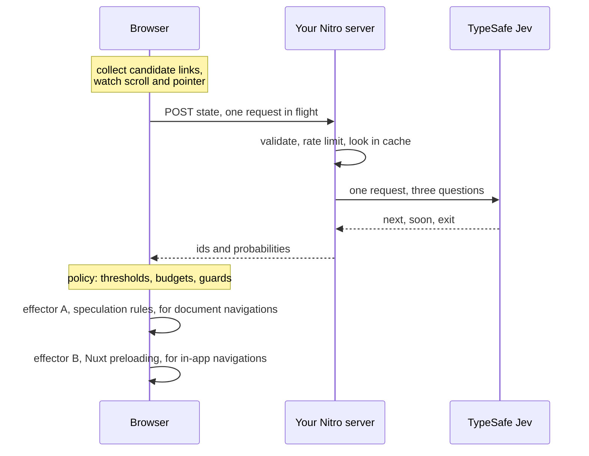

<p align="center">
  <a href="https://oskarlebuda.github.io/nuxt-precog">
    
  </a>
</p>

<p align="center">
  <a href="https://www.npmjs.com/package/nuxt-precog"></a>
  <a href="https://www.npmjs.com/package/nuxt-precog"></a>
  <a href="./LICENSE"></a>
  <a href="https://nuxt.com"></a>
</p>

<p align="center">
  <a href="https://oskarlebuda.github.io/nuxt-precog"><b>Documentation</b></a>
</p>

---

A Nuxt module that asks [TypeSafe](https://typesafe.ai/) Jev which link a visitor is about to
click, then warms exactly that navigation with the
[Speculation Rules API](https://developer.mozilla.org/en-US/docs/Web/API/Speculation_Rules_API)
and Nuxt's own route preloading. It comes with an overlay that draws the probabilities on top
of the page, so you can watch it guess.

Not a general prefetcher. `NuxtLink` already prefetches every link that enters the viewport.
This one tries to prefetch three links instead of thirty, and to start before the hover.

## Quickstart

```sh
npx nuxt module add nuxt-precog
```

Set a key from [console.typesafe.ai](https://console.typesafe.ai/settings/keys):

```sh
# .env
NUXT_PRECOG_API_KEY="your-api-key"
```

That is the whole setup. The defaults prefetch at most three links and never prerender.
Run `nuxt dev`, open a page and press <kbd>Shift</kbd>+<kbd>P</kbd> to see what it is doing.

To let it prerender the top guess as well:

```ts
// nuxt.config.ts
export default defineNuxtConfig({
  modules: ["nuxt-precog"],
  precog: {
    mode: "auto",
    takeOverNuxtLinkPrefetch: true,
  },
});
```

Every option, the composable and the hooks are in
**[the documentation](https://oskarlebuda.github.io/nuxt-precog/guide/options)**.

## What it actually buys you

Eight synthetic sessions per arm, six navigations each, real Chrome against a production
build, throttled to 250 ms latency and 2000 kbit/s. Method and caveats in
[the benchmark page](https://oskarlebuda.github.io/nuxt-precog/guide/benchmarks); reproduce
with `pnpm bench`.

| arm                 | off    | native | precog    |
| ------------------- | ------ | ------ | --------- |
| navigation median   | 145 ms | 142 ms | **63 ms** |
| navigation p95      | 403 ms | 403 ms | 389 ms    |
| hit rate            | n/a    | n/a    | 46%       |
| top guess correct   | n/a    | n/a    | 27%       |
| wasted kB / session | 6.9    | 6.9    | 18.6      |
| jev calls / session | 0      | 0      | 14.6      |

Read that honestly:

- The median navigation gets about twice as fast. **The p95 does not move.** The tail is the
  navigations the model got wrong, and no amount of prediction fixes those.
- It roughly triples wasted bytes, from about 7 kB to about 19 kB per session.
- It costs about 15 Jev calls per session, 18 percent of which the server answered from cache.
- `native` is document speculation rules at `eagerness: moderate`. It is free, needs no model
  and no key, and in this benchmark it ties `off`, because a visitor who clicks soon after the
  cursor lands does not give the browser enough hover to work with. That gap is what precog is
  for. If your visitors hover for a second before clicking, use `native` and save the money.
- `off` is not "nothing": `NuxtLink` still prefetches on interaction in every arm.
- The visitors are synthetic and their click model is a guess. Hit rate and accuracy describe
  how the module does against that model, not against your users.

## How it works

One request per prediction, three questions, evaluated in parallel:

| Key    | Type                                      | Asked                                                     |
| ------ | ----------------------------------------- | --------------------------------------------------------- |
| `next` | choice over the candidate ids plus `none` | Which of these links will the visitor click next, if any? |
| `soon` | score over four levels                    | How soon will the visitor open another page?              |
| `exit` | yes/no                                    | Will the visitor leave the site entirely instead?         |



The short version of the important part: **a `NuxtLink` click is not a document navigation**,
so speculation rules do nothing for it. That is measured in `e2e/spa-vs-document.spec.ts`. The
in-app win comes from preloading the payload of the pages the model picked, which only exists
for prerendered routes.

:mag: [The full walk-through](https://oskarlebuda.github.io/nuxt-precog/guide/how-it-works)

## Limitations

- **Speculation rules are Chromium only.** Elsewhere, prefetch falls back to
  `<link rel="prefetch">` and prerender is skipped. Nuxt preloading works everywhere.
- **Payload preloading needs a payload**, which means prerendered routes with
  `experimental.payloadExtraction`. On a purely server-rendered route the win is small.
- **Prerendering runs the page's JavaScript.** Analytics fire, `onMounted` fetches run. This is
  why `mode` is `'prefetch'` by default.
- **It costs money per prediction.** Tune `minIntervalMs`, `cache.ttlSeconds` and the budgets
  before pointing it at real traffic.
- **Jev is in early access.** Every failure path returns an empty prediction and the page is
  untouched.

## Privacy

The module sends page context and part of a browsing path to a third party. It sends no
identifier of any kind, no full URLs, and never the API key.
[The privacy page](https://oskarlebuda.github.io/nuxt-precog/guide/privacy) lists exactly what
goes over the wire and how to gate it behind consent.

## Development

```sh
pnpm install
pnpm dev              # playground at localhost:3000, runs without an API key
pnpm check            # lint, typecheck, unit tests
pnpm test:e2e         # builds everything and drives real Chrome
pnpm bench            # writes bench/results/bench.md
pnpm docs:dev         # the documentation site
pnpm client:dev       # the DevTools tab on its own, while working on it
```

`pnpm dev:prepare` builds the DevTools tab client into `dist/client`, which `pnpm dev` runs
first. To work on the tab itself, start `pnpm client:dev` and run the playground with
`PRECOG_DEVTOOLS_LOCAL=1`, which proxies the tab to that dev server instead.

The unit suite never touches the network: `test/mock-typesafe.ts` is a small stand-in for the
System One API. The live smoke test is skipped unless `TYPESAFE_API_KEY` is set.

One note that did not fit on the site: [decisions](./.github/DECISIONS.md), the running log of
why things are the way they are.

## Thanks

- [TypeSafe](https://typesafe.ai/) for **Jev**. It answers typed questions in about 100 ms,
  which is the only reason guessing a click before it happens is possible at all. A model that
  writes text would arrive long after the visitor had already clicked.
- [advocaat](https://github.com/pithings/advocaat) by [pi0](https://github.com/pi0), the small
  typed client this talks to Jev through. Its source is also where `test/mock-typesafe.ts` took
  the wire format from, which is what lets the whole test suite run offline.

## License

[MIT](./LICENSE)
